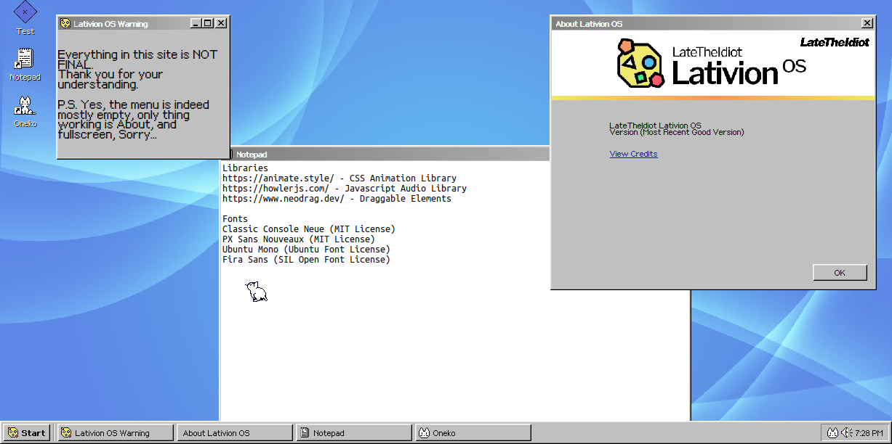

# 

A Simulated Operating System in the Web



# What is Lativion OS? Is it a real operating system?
Lativion OS is a **fake** *simulated* operating system that uses the Svelte framework and SvelteKit. I wanted to make a website after taking a haitus of programming sites. But I didn't want to make a bland old boring portfolio site. I wanted Pizzazz! So, came this, proud of the result so far! Lots more to come though!

# Sounds cool! May I use this for my website as well?
Honestly? Go for it, I would not recommend using this repository right now. But I will make a separate template repository so it will be easier.

 Now here comes the boring stuff...

# Developing

Make sure you install Node.JS (perferably version >=22) and Git.

```bash
$ git clone https://github.com/Late-Is-Cool/lativion-os.git
$ cd lativion-os
# npm, yarn, pnpm, whatever suites your needs
$ npm install
```

After you cloned the repository and installed the dependencies using your node package manager, It's time to start the dev server!

```bash
$ npm run dev

# or use this if you want to open it in a new browser tab
$ npm run dev -- --open
```

Any changes you make while the server is running will automatically update.

# Building

Feel like you done enough work and it's good for potentially prod? Build it!

```bash
$ npm run build
```

Then you can preview your build by running `npm run preview` or actually use it for production by doing `node build/index.js`

# How can I contribute to this wonderful project?

Many things actually, sharing my website online will do a bunch! (please don't DDOS it...)

If you want more things on my site, you can fork this repository and make your changes.

Making programs may be difficult in the current state of this project. But hopefully I can refactor a bunch of things (especially windows)

# Is there an active dev log currently?

Soon to be on https://blog.latetheidiot.dev/lativion-os
